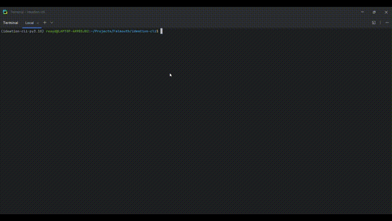

# Ideation CLI Tool

## Overview
The **Ideation CLI Tool** is a Python command-line application designed to help users apply various ideation techniques to creative artifacts. It integrates OpenAI's GPT models and Autogen to generate innovative ideas based on selected methods. Users can specify an artifact, choose an ideation technique, set the number of ideas to generate, and select whether they want a text or image-based output.



## Features
- Supports multiple ideation techniques, including Brainstorming, Mind Maps, SCAMPER, and more.
- Generates text-based or image-based outputs.
- Provides an interactive CLI with dropdown selections.
- Allows users to choose the AI model (GPT-4, GPT-3.5, or DALL·E for images).
- Uses OpenAI API and Autogen for idea generation.

## Installation
To install and set up the project, follow these steps:

### 1. Clone the Repository
```sh
git clone https://github.com/yourusername/ideation-cli.git
cd ideation-cli
```

### 2. Install Dependencies
Ensure you have [Poetry](https://python-poetry.org/) installed. Then, run:
```sh
poetry install
```

### 3. Set Up API Keys
Create an `OPENAI_API_KEY` environment variable with your OpenAI API key in your `~/.bashrc`:
```
export OPENAI_API_KEY=your_api_key_here
```

### 4. Run the CLI
To start the ideation process, run:
```sh
poetry run python ideation_cli/cli.py
```
or the `Makefile` shortcut:
```sh
make cli
```

## Usage
Upon running the tool, you will be prompted to enter the following:
1. **Describe the artifact** – Provide details about the object to be modified.
2. **Choose an ideation technique** – Select from methods like Brainstorming, Mind Maps, etc.
3. **Set the number of ideas to generate** – Defaults to 10 if not specified.
4. **Select the output type** – Choose between `Text` or `Image`.
5. **Select an AI model** – Choose from various OpenAI models
   - gpt-4o (best for text generation)
   - gpt-4o-mini (faster and cheaper)
   - o1 (for more complex reasoning)

The tool will then generate the specified number of ideas and display them in the terminal.

## Example Workflow
```sh
poetry run python ideation_cli/cli.py
```
### Sample Interaction:
```
Describe the artifact you want to modify:
> A short poem about the sea
Choose an ideation technique:
> Brainstorming
How many ideas should be generated? (Default: 1)
> 5
Select output type:
> Text
Select an AI model:
> gpt-4o-mini
```
### Output:
```
Generated Ideas:
1. Transform the poem into a rhythmic sea shanty.
2. Rewrite the poem as a haiku.
3. Convert the poem into a short story.
4. Mix elements from the poem with a famous myth.
5. Generate an AI-assisted collaborative poem.
```

## Contributing
Contributions are welcome! If you have ideas for improving the tool, please submit a pull request.

## License
This project is licensed under the MIT License. See `LICENSE` for details.

## Future Enhancements
- Integration with Autogen multi-agent brainstorming.
- Support for additional creative techniques.
- Expanded image processing capabilities.

## References
- https://community.openai.com/t/hallucinations-can-be-useful/274284